# Week 3

## Exercises 2: Single Table Queries

### Question 1: Write a query that prints out all the columns in the goal table.
SELECT * FROM goal;
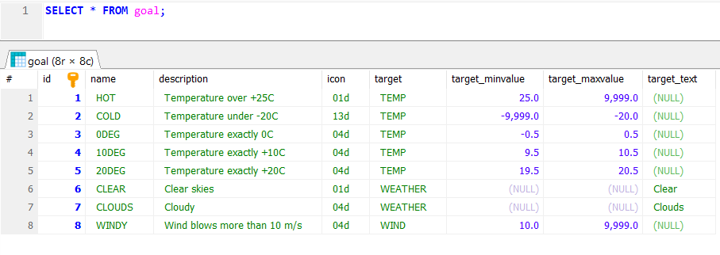

### Question 2: Write a query that prints out the name and type of each airport in Finland. The country code for Finland is: FI 
SELECT name, type FROM airport WHERE iso_country = "FI";
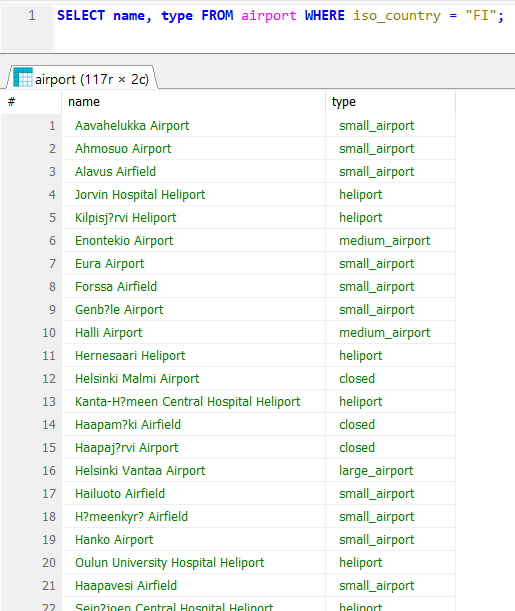

### Question 3: Write a query that prints out the names of all Finnish airports in alphabetical order. The country code for Finland is: FI.
SELECT name FROM airport WHERE iso_country = "FI" ORDER BY name;
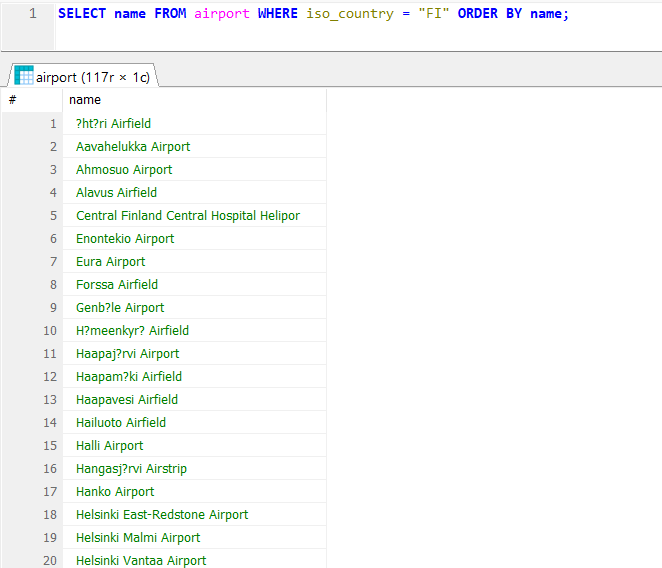

### Question 4: Write a query that prints out the name and type of each Finnish airport. Order the result first by type and secondly by name.
SELECT name, type FROM airport WHERE iso_country = "FI" ORDER BY type, name;
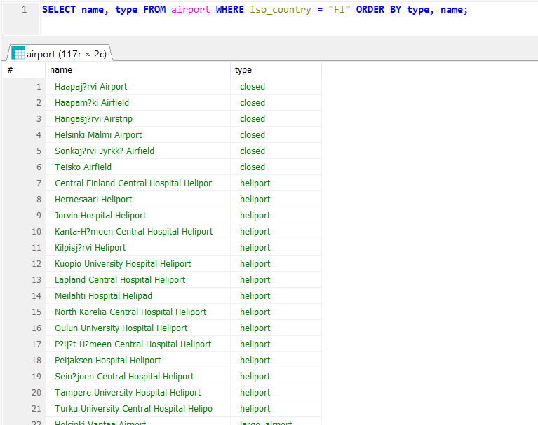

### Question 5: Write a query that prints out the names of all countries that start with the letter F from the country table.
SELECT name FROM country WHERE name LIKE "F%";
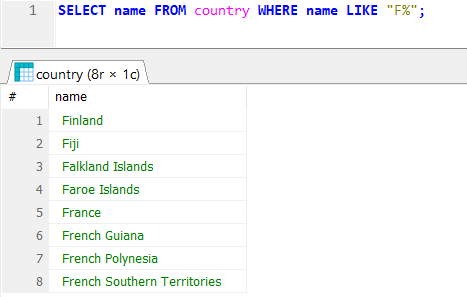

### Question 6: Write a query that prints out all country names in the country table that include the letter F
SELECT name FROM country WHERE name LIKE "%F%";
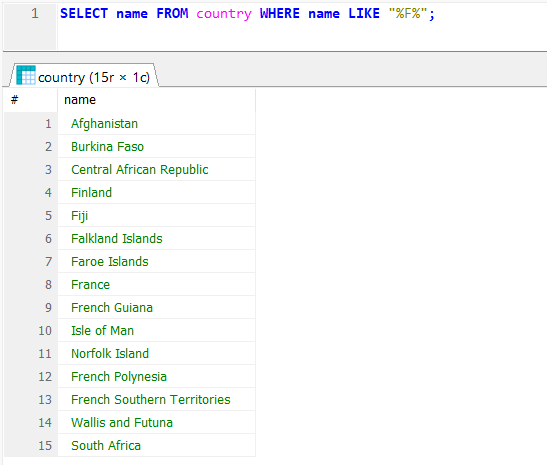

### Question 7: What is Vesa's current location? 
SELECT location FROM game WHERE screen_name = "Vesa";
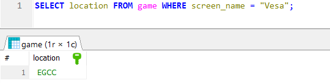

### Question 8: How much of his CO2 budget has Ilkka consumed?
SELECT co2_consumed FROM game WHERE screen_name = "Ilkka";
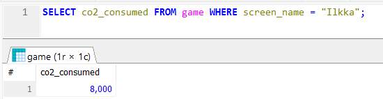

### Question 9: What is the original CO2 budget? Print out the CO2 budget value only once.
SELECT co2_budget FROM game WHERE screen_name = "Ilkka";
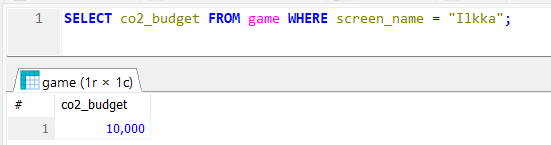

### Question 10: How much of his CO2 budget does Ilkka have left? Complete the query so that the result includes the following fields: screen_name, co2_budget, co2_consumed and co2_left.
SELECT screen_name, co2_budget, co2_consumed, co2_budget - co2_consumed AS co2_left FROM game WHERE screen_name = "Ilkka";
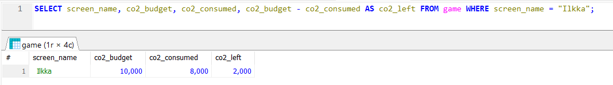

## Exercises 3: Multiple Table Queries

### Question 1: Write a query that lists the names of all countries and airports. Select Iceland as the country and assign the following aliases:
### name column of the country table:  alias "country name"
### name column of the airport table: alias "airport name"
SELECT country.name AS "country name", airport.name AS "airport name"
FROM airport, country
WHERE airport.iso_country = country.iso_country AND country.name = "Iceland";
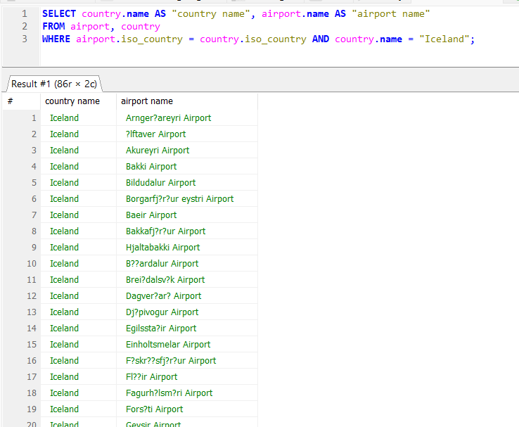

### Question 2: Write a query  to list the names of all large airports in France. Assign the name column the alias "airport name".
SELECT airport.name AS "airport name"
FROM airport, country
WHERE airport.iso_country = country.iso_country AND country.name = "France" AND airport.type = "large_airport";
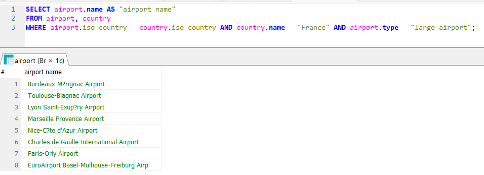

### Question 3: Write a query that lists the names and country names of all airports on Antartica. Use aliases country_name and airport_name. SQLite does not support aliases with multiple words. MariaDB does, but requires the name to be enclosed in quotation marks.
### Hint: Continent = "an"
SELECT country.name AS country_name, airport.name AS airport_name
FROM airport, country
WHERE airport.iso_country = country.iso_country AND country.continent = "AN";
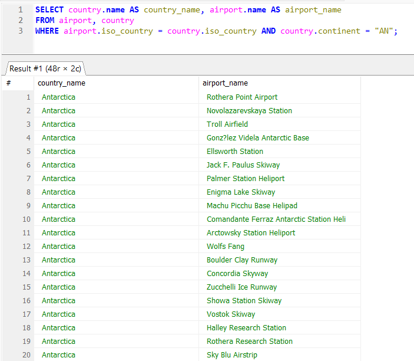

### Question 4: What is the height of Heini's current location measured from the sea level?
SELECT elevation_ft
FROM game, airport
WHERE game.location = airport.ident AND screen_name = "Heini";
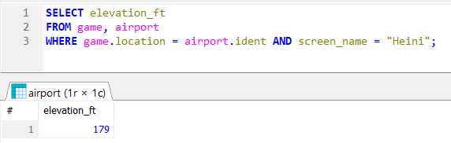

### Question 5: What is the height of Heini's current location measured from the sea level? Print out the result in meters and assign the result the alias elevation_m. One feet corresponds to 0.3048 meters.
SELECT airport.elevation_ft * 0.3048 AS elevation_m
FROM game, airport
WHERE game.location = airport.ident AND screen_name = "Heini";
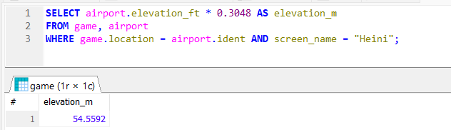

### Question 6: What is the name of the airport Ilkka is currently at?
SELECT airport.name
FROM game, airport
WHERE game.location = airport.ident AND screen_name = "Ilkka";
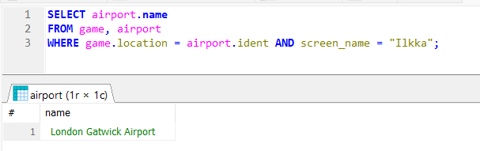

### Question 7: What is the name of the country Ilkka is currently at?
SELECT country.name
FROM game, airport, country
WHERE game.location = airport.ident AND airport.iso_country = country.iso_country AND screen_name = "Ilkka";
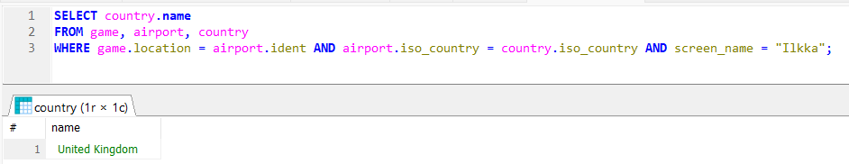

### Question 8: List the weather condition goals Heini as achieved so far.
SELECT name
FROM game, goal_reached, goal
WHERE game.id = goal_reached.game_id AND goal.id = goal_reached.goal_id AND screen_name = "Heini";
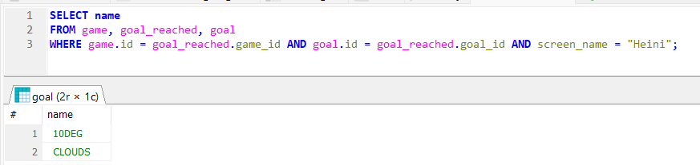

### Question 9: Print out the name of the airport where Ilkka achieved the clouds weather goal.
SELECT airport.name
FROM airport, game, goal_reached, goal
WHERE airport.ident = game.location AND game.id = goal_reached.game_id AND goal.id = goal_reached.goal_id AND screen_name = "Ilkka" AND goal.name = "CLOUDS";
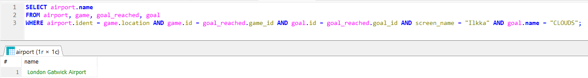

### Question 10: Print out the name of the country where Ilkka achieved the clouds goal.
SELECT country.name
FROM country, airport, game, goal_reached, goal
WHERE country.iso_country = airport.iso_country AND airport.ident = game.location 
	AND game.id = goal_reached.game_id AND goal.id = goal_reached.goal_id 
	AND screen_name = "Ilkka" AND goal.name = "CLOUDS";
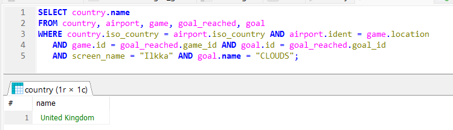