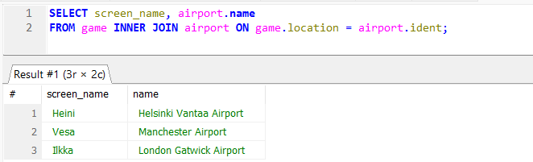

# Week 4

## Exercises 4: Join

### Question 1: List all Finnish airports that provide scheduled services. The result must include both the name of the country as well as the name of the airport.
### Hint 1: Country name is Finland.
### Hint 2: You need quotation marks around an alias that consists of several words.
SELECT country.name AS "country name", airport.name AS "airport name"
FROM airport INNER JOIN country ON airport.iso_country = country.iso_country
WHERE country.name = "Finland" AND airport.scheduled_service = "yes";

### Question 2: List the names and current airports of all players.
SELECT screen_name, airport.name
FROM game INNER JOIN airport ON game.location = airport.ident;

 

### Question 3: List the names and current countries of all players.
SELECT screen_name, country.name
FROM game INNER JOIN airport ON game.location = airport.ident
	INNER JOIN country ON airport.iso_country = country.iso_country;

### Question 4: List the names of all airports that include the string "Hels" and the names of any players that might currently be on any of the listed airports.
SELECT airport.name, screen_name
FROM airport LEFT JOIN game ON airport.ident = game.location
WHERE airport.name LIKE "%Hels%";

### Question 5: List the names of all weather goals and the names of any players that have so far achieved the listed goals.
SELECT goal.name, screen_name
FROM goal LEFT JOIN goal_reached ON goal.id = goal_reached.goal_id
	LEFT JOIN game ON goal_reached.game_id = game.id;

## Exercises 5: Subqueries

### Question 1: One country has an airport where the airport name begins with the word "Satsuma". Print out the name of the country.
SELECT name
FROM country
WHERE iso_country IN (
	SELECT airport.iso_country
	FROM airport
	WHERE airport.name LIKE "Satsuma%");

### Question 2: List the names of all airports in Monaco.
SELECT name
FROM airport
WHERE iso_country IN (
	SELECT iso_country
	FROM country
	WHERE NAME = "Monaco");

### Question 3: List the names of all players who have achieved the clouds goal.
SELECT screen_name
FROM game
WHERE id IN (
	SELECT game_id FROM goal_reached WHERE goal_id IN (
		SELECT id FROM goal WHERE name ="CLOUDS"));

### Question 4: List all countries that have no airports.
SELECT name
FROM country
WHERE iso_country NOT IN (
	SELECT iso_country 
	FROM airport);

### Question 5: Which weather goals has Heini not achieved yet?
SELECT name
FROM goal
WHERE id NOT IN (
	SELECT goal_id 
	FROM goal_reached
	WHERE game_id IN (SELECT id FROM game WHERE screen_name = "Heini"));

