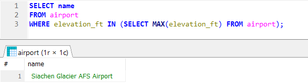

# Week 5

## Exercises 6: Aggregate Queries

### Question 1: What is the elevation of the highest airport location?
SELECT max(elevation_ft)
FROM airport;

### Question 2: Write a query that lists all continents and the number of countries on them.
SELECT continent, count(*)
FROM country
GROUP BY continent;

### Question 3: List the names of all players and the number of weather goals they have achieved.
SELECT screen_name, count(*)
FROM game, goal_reached
WHERE game.id = goal_reached.game_id
GROUP BY screen_name;

### Question 4: Which player has the smallest carbon foot print?
### Hint 1: Do not use the desc limit if there are multiple airports with the same elevation: 
### desc limit only selects one of them. You need all airports with the highest elevation.
### Hint 2: You need to perform a subquery even though your query only targets one table.
SELECT screen_name
FROM game
WHERE co2_consumed IN (
	SELECT MIN(co2_consumed)
	FROM game
);

### Question 5: Print out the names of all countries and the number of airports in each country. 
### Order the results by the airport count in descending order. Only include the top 50 countries 
### with the largest number of airports.
SELECT country.name, count(*)
FROM country, airport
WHERE country.iso_country = airport.iso_country
GROUP BY country.iso_country
ORDER BY COUNT(*) DESC
LIMIT 50;

### Question 6: List the countries with more than 1000 airports. Use the iso_country field in the query.
SELECT country.name
FROM country, airport
WHERE country.iso_country = airport.iso_country
GROUP BY country.iso_country
HAVING COUNT(*) > 1000;

### Question 7: Print out the name of the highest airport in the world.
### Hint 1: Do not use desc limit. In case there are several airports with the same elevation value, 
### desc limit only select one of them.
### Hint 2: You need to perform a subquery even though the query only targets one table.
SELECT name
FROM airport
WHERE elevation_ft IN (SELECT MAX(elevation_ft) FROM airport);

### Question 8: In which country does the highest airport reside in?
### Hint 1: Do not use desc limit. If there are several airports with the same elevation value, 
### desc limit only selects one of them.
### Hint 2: Use subqueries.
SELECT country.name
FROM country
WHERE iso_country IN (
	SELECT iso_country
	FROM airport
	WHERE elevation_ft IN (SELECT MAX(elevation_ft) FROM airport)
);

### Question 9: How many weather goals has Vesa achieved so far?
SELECT count(*)
FROM goal_reached, game
WHERE goal_reached.game_id = game.id AND game.screen_name = "Vesa"
GROUP BY game_id;

### Question 10: What is the name of the airport that resides closest to the polar regions?
### Hint: The latitude value of both the north and south pole is 0.
SELECT name
FROM airport
WHERE latitude_deg = (SELECT MIN(latitude_deg) FROM airport);

## Exercises 7: Update Queries

### Question 1: Vesa flies from his current location to the Nottingham Airport. At the same time, 
### Vesa's carbon footprint increases by 500. Update the information to the database.
### Hint 1: You need to use a subquery to find out the ident value of Nottingham Airport.
UPDATE game
SET co2_consumed = co2_consumed + 500, location = (
		SELECT ident
		FROM airport
		WHERE name = "Nottingham Airport"
	)
WHERE screen_name = "Vesa";

### Question 2: Prepare your own database for the project by deleting all dummy data relating to the game state. 
### To maintain referential integrity, you have to delete the data in a specific order.
### Do you have to delete data first from the game table or from the goal_reached table?

### Question 3: Delete the dummy data from the goal_reached table.
DELETE FROM goal_reached;

### Question 4: Delete the data from the game table.
DELETE FROM game;

